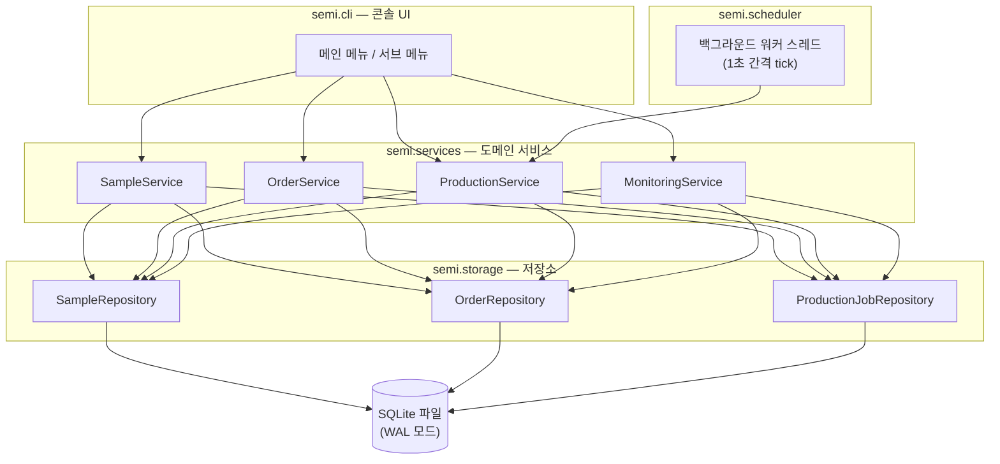

# 시스템 설계: 반도체 시료 생산주문관리 시스템 (S-Semi)

## 문서 정보

| 항목 | 내용 |
|---|---|
| 문서 목적 | `PRD.md` 요구사항에 대한 상세 시스템 설계 |
| 근거 문서 | `PRD.md` |
| 작성일 | 2026-07-15 |

---

## 0. PRD 미결 사항에 대한 확정 의사결정

`PRD.md`가 상세 설계 단계로 위임했거나 표현이 모호했던 항목을 사용자와 논의하여 다음과 같이 확정한다.

| 항목 | 결정 | 비고 |
|---|---|---|
| 영구 저장소 | **SQLite** 단일 파일 DB | 트랜잭션/동시성/쿼리에 유리, 별도 서버 불필요 |
| 생산 진행 방식 | **백그라운드 스레드가 실제 시스템 시간 기준으로 실시간 진행** | 메뉴 조작과 무관하게 생산이 계속 진행됨 |
| 평균 생산시간 단위 | **초(seconds)** | 실시간 시뮬레이션을 사람이 체감할 수 있는 속도로 진행하기 위함 |
| 주문 식별자 | **시스템 자동 채번** (order_id, INTEGER, auto-increment) | PRD 3.2 속성 표에는 없으나 승인/거절/출고 시 개별 주문 선택에 필수 |
| 재고 차감 시점 | **출고(RELEASE) 처리 시점에만 차감** | 아래 0.1절 참조. PRD 4.4/4.7 최신판 반영 |

### 0.1 재고 차감 시점 및 "가용 재고" 결정에 대한 근거

`PRD.md` 4.4절(최신판)은 승인 시점의 재고 충분/부족 판정을 **"가용 재고"** 기준으로 하도록 정의한다.

```text
가용 재고 = 해당 시료의 현재 재고 수량
          - (해당 시료에 대해 아직 출고되지 않은 CONFIRMED 상태 주문 수량 합계)
          - (해당 시료의 PRODUCING 상태 주문들이 승인 당시 이미 점유한 기존 재고 몫의 합계)
```

- "`PRODUCING` 주문이 점유한 기존 재고 몫"은 그 주문이 승인되던 시점에 사용된 가용 재고, 즉 `주문 수량 - 그때 등록된 부족분(shortfall)`이다. 이 값은 해당 주문이 `CONFIRMED`로 전환되기 전까지 고정되어 계속 가용 재고에서 제외된다.
- 재고 차감 자체(`stock_quantity` 값 변경)는 승인 시점이나 생산 완료 시점에는 일어나지 않고, **출고(RELEASE) 처리 시점에만** 발생한다. 승인/생산완료 시점엔 위 "가용 재고" 계산을 통해 논리적으로만 선점(committed)될 뿐이다.
- 생산 완료 시에는 PRD 4.6 그대로 실 생산량만큼 재고를 **증가**시키고 주문을 `CONFIRMED`로 전환한다.
- `CONFIRMED` 상태인 모든 주문은 출고 전까지 재고에서 차감되지 않은 채로 "미완료 주문 수량"에 남아 모니터링(4.5)과 일관된다.

**오버셀 방지 불변식**: 위 가용 재고 계산 방식(CONFIRMED 합계뿐 아니라 PRODUCING의 기존 재고 점유분까지 미리 제외)을 승인 로직에 그대로 구현하면, `실 생산량 = ceil(부족분/수율) ≥ 부족분`이 항상 성립하는 한(즉 시료 등록 시 `0 < yield_rate <= 1`이 지켜지는 한) **"해당 시료의 현재 재고 ≥ 해당 시료의 미출고 CONFIRMED 주문 수량 합계"라는 불변식이 모든 승인/생산완료/출고 이벤트를 거쳐도 항상 유지된다.** 따라서 4.3절 출고 처리 시 재고 부족으로 거부되는 경우는 발생하지 않는다 (과거 버전의 "알려진 엣지 케이스"는 이 가용 재고 확장으로 해소되었다).

---

## 1. 아키텍처 개요



- **단일 프로세스, 다중 스레드** 구조: 메인 스레드는 콘솔 메뉴 루프를 실행하고, 데몬 스레드 하나가 생산 큐를 실시간으로 진행시킨다.
- 두 스레드는 서비스/저장소 계층을 공유하며, SQLite 접근은 `threading.Lock`으로 직렬화한다 (5절 참조).
- 프로그램 종료 후 재실행 시에도 진행 중이던 생산 작업은 DB에 저장된 시작 시각을 기준으로 경과 시간을 재계산하여 이어서 진행된다 (실제 시스템 시간 기준이므로 프로세스가 꺼져 있던 동안에도 시간은 흐른 것으로 간주).

---

## 2. 데이터베이스 스키마 (SQLite)

```sql
CREATE TABLE samples (
    sample_id             TEXT PRIMARY KEY,
    name                  TEXT NOT NULL,
    avg_production_seconds REAL NOT NULL CHECK (avg_production_seconds > 0),
    yield_rate            REAL NOT NULL CHECK (yield_rate > 0 AND yield_rate <= 1),
    stock_quantity        INTEGER NOT NULL DEFAULT 0 CHECK (stock_quantity >= 0)
);

CREATE TABLE orders (
    order_id      INTEGER PRIMARY KEY AUTOINCREMENT,
    sample_id     TEXT NOT NULL REFERENCES samples(sample_id),
    customer_name TEXT NOT NULL,
    quantity      INTEGER NOT NULL CHECK (quantity > 0),
    status        TEXT NOT NULL CHECK (status IN
                    ('RESERVED','REJECTED','PRODUCING','CONFIRMED','RELEASE')),
    created_at    TEXT NOT NULL   -- ISO8601
);

CREATE TABLE production_jobs (
    job_id               INTEGER PRIMARY KEY AUTOINCREMENT,
    order_id             INTEGER NOT NULL UNIQUE REFERENCES orders(order_id),
    sample_id            TEXT NOT NULL REFERENCES samples(sample_id),
    shortfall_quantity   INTEGER NOT NULL,   -- 부족분 = 주문수량 - 승인시점 재고
    actual_quantity      INTEGER NOT NULL,   -- ceil(부족분 / 수율)
    total_duration_seconds REAL NOT NULL,    -- 평균생산시간 × 실 생산량
    status               TEXT NOT NULL CHECK (status IN ('QUEUED','IN_PROGRESS','DONE')),
    enqueued_at          TEXT NOT NULL,      -- FIFO 정렬 기준
    started_at           TEXT               -- IN_PROGRESS 진입 시각, 그 전까지 NULL
);
```

- `orders.status` 전이는 PRD 3.3 상태 흐름을 그대로 따른다.
- `production_jobs`는 승인 시점에 재고가 부족했던 주문 1건당 정확히 1건만 생성된다 (order_id UNIQUE).
- FIFO 순서는 `enqueued_at`(동시 등록 시 `job_id`로 tie-break) 기준으로 정렬한다.

---

## 3. 패키지 구조

```
semi/
├── __init__.py
├── domain/
│   ├── models.py          # Sample, Order, ProductionJob 데이터클래스, OrderStatus/JobStatus enum
├── storage/
│   ├── db.py              # 연결 생성, PRAGMA 설정(WAL, busy_timeout), 스키마 초기화
│   ├── sample_repository.py
│   ├── order_repository.py
│   └── production_job_repository.py
├── services/
│   ├── sample_service.py      # 등록/조회/검색
│   ├── order_service.py       # 접수/승인/거절 (승인 시 재고 스냅샷 판정 + 생산 큐 등록)
│   ├── production_service.py  # tick() 진행 로직, 현재 작업/큐 조회, 진행률·예상완료시간 계산
│   └── monitoring_service.py  # 상태별 주문 집계, 재고 여유/부족/고갈 판정
├── scheduler/
│   └── background_worker.py   # daemon Thread, 1초 간격으로 production_service.tick() 호출
├── cli/
│   ├── app.py              # 진입점: DB 초기화 → 백그라운드 워커 시작 → 메뉴 루프
│   └── menus.py            # PRD 4.1~4.7 메뉴 렌더링 및 입력 처리
```

---

## 4. 핵심 흐름

### 4.1 주문 승인 (`OrderService.approve(order_id)`)

1. 트랜잭션 시작, 락 획득.
2. 대상 주문이 `RESERVED` 상태인지 확인 (아니면 오류).
3. 해당 시료의 **가용 재고**를 계산한다 (0.1절 공식):
   - `confirmed_sum = SUM(orders.quantity WHERE sample_id=? AND status='CONFIRMED')`
   - `producing_reserved_sum = SUM(orders.quantity - production_jobs.shortfall_quantity WHERE sample_id=? AND orders.status='PRODUCING')` (production_jobs를 order_id로 조인)
   - `available = stock_quantity - confirmed_sum - producing_reserved_sum`
4. `available >= order.quantity` 이면:
   - 주문 상태를 `CONFIRMED`로 변경. (재고는 차감하지 않음 — 0.1절 결정)
5. 그렇지 않으면:
   - `shortfall = order.quantity - available`
   - `actual_quantity = ceil(shortfall / yield_rate)`
   - `total_duration_seconds = avg_production_seconds * actual_quantity`
   - `production_jobs`에 `QUEUED` 상태로 등록 (`shortfall_quantity = shortfall`, `enqueued_at = now`)
   - 주문 상태를 `PRODUCING`으로 변경.
6. 커밋, 락 해제.

`production_jobs.shortfall_quantity`를 저장해두면 "기존 재고 점유분"(`order.quantity - shortfall_quantity`)을 매번 재계산할 수 있으므로, 별도 컬럼 추가 없이 3번의 `producing_reserved_sum` 쿼리로 충분하다.

### 4.2 생산 진행 (`ProductionService.tick()`, 백그라운드 워커가 1초마다 호출)

1. 락 획득.
2. `IN_PROGRESS` 작업이 없고 `QUEUED` 작업이 있으면: 가장 오래된 작업을 `IN_PROGRESS`로 전환하고 `started_at = now` 설정 (생산 라인은 1개뿐이므로 동시에 2건 이상 `IN_PROGRESS` 불가).
3. `IN_PROGRESS` 작업이 있으면: `elapsed = now - started_at`.
   - `elapsed >= total_duration_seconds`이면 작업 완료 처리:
     - 해당 시료의 `stock_quantity += actual_quantity`
     - 해당 주문 상태를 `PRODUCING → CONFIRMED`로 전환
     - 작업 상태를 `DONE`으로 변경
     - 다음 `QUEUED` 작업이 있으면 즉시 `IN_PROGRESS`로 전환 (2번과 동일 로직)
4. 커밋, 락 해제.

진행률/예상 완료 시각(PRD 4.6 "생산 현황 표시")은 별도 조회 함수로 계산하며 DB를 변경하지 않는다.
- 진행률 = `min(1, elapsed / total_duration_seconds)`
- 현재까지 생산량(추정) = `floor(진행률 × actual_quantity)`
- 예상 완료 시각 = `started_at + total_duration_seconds`
- 아직 큐에서 대기 중인 작업의 예상 완료 시각 = 현재 `IN_PROGRESS` 작업의 남은 시간 + 자신보다 앞선 대기 작업들의 `total_duration_seconds` 합 + 자신의 `total_duration_seconds`

### 4.3 출고 처리 (`OrderService.release(order_id)`)

1. 락 획득.
2. 대상 주문이 `CONFIRMED` 상태인지 확인 (아니면 오류).
3. `stock_quantity -= order.quantity`, 주문 상태를 `RELEASE`로 전환.
4. 커밋, 락 해제.

0.1절의 오버셀 방지 불변식(`stock_quantity >= 해당 시료의 미출고 CONFIRMED 합계`)이 4.1절 승인 로직에 의해 항상 유지되므로, 이 시점에 `stock_quantity < order.quantity`가 되는 경우는 이론적으로 발생하지 않는다. 다만 구현 방어 차원에서 `stock_quantity`가 음수가 되지 않도록 `CHECK (stock_quantity >= 0)` 제약(2절 스키마)에 의존하여, 만약 불변식이 깨지는 버그가 있다면 UPDATE 자체가 DB 레벨에서 실패하도록 한다 (조용히 음수 재고가 저장되는 것을 방지).

### 4.4 모니터링 (`MonitoringService`)

- 상태별 주문 집계: `RESERVED`/`CONFIRMED`/`PRODUCING`/`RELEASE`별 목록·건수 (PRD 4.5, `REJECTED` 제외).
- 시료별 재고 상태: 시료마다 `outstanding = SUM(quantity WHERE status IN ('RESERVED','CONFIRMED','PRODUCING'))`를 계산한 뒤, 다음 순서로 판정한다 (PRD 4.5, 규칙 14 — `재고=0`이 `outstanding`과 무관하게 최우선):
  1. `stock_quantity == 0` 이면 **고갈**
  2. 그 외 `stock_quantity >= outstanding` 이면 **여유**
  3. 그 외 (`0 < stock_quantity < outstanding`) 이면 **부족**

---

## 5. 동시성 처리 전략

- 메인 스레드(콘솔 메뉴)와 백그라운드 워커 스레드가 같은 SQLite 파일을 공유한다.
- SQLite 연결은 스레드별로 별도 생성(`check_same_thread=True` 유지, 스레드 간 연결 공유 금지)하고, `PRAGMA journal_mode=WAL`, `PRAGMA busy_timeout=5000`을 적용해 파일 잠금 대기를 흡수한다.
- 그와 별개로, 서비스 계층의 쓰기 트랜잭션(승인/거절/출고/tick)은 프로세스 내 `threading.Lock` 하나로 직렬화하여, 두 스레드가 동시에 같은 재고/주문 행을 수정해 발생할 수 있는 경쟁 상태(예: 승인 처리 중 tick이 같은 시료 재고를 갱신)를 원천 차단한다.
- 읽기 전용 조회(메뉴 표시용)는 락 없이 수행해도 무방하나, 표시 일관성을 위해 동일 락을 짧게 사용하는 것을 기본값으로 한다.

---

## 6. 검증 규칙 (도메인 불변식)

| 대상 | 규칙 |
|---|---|
| 시료 등록 | `sample_id` 중복 불가, `avg_production_seconds > 0`, `0 < yield_rate <= 1` |
| 주문 접수 | 존재하지 않는 `sample_id`로 생성 불가, `quantity > 0` |
| 승인/거절 | `RESERVED` 상태 주문에만 적용 가능 |
| 출고 | `CONFIRMED` 상태 주문에만 적용 가능 (0.1절 불변식에 의해 재고 부족 상황은 발생하지 않음) |

---

## 7. 남은 확인 필요 사항

현재까지 파악된 범위에서는 추가 확인이 필요한 모호점이 없다. 구현 중 새로운 애매함이 발견되면 가정하지 않고 별도로 확인한다.
