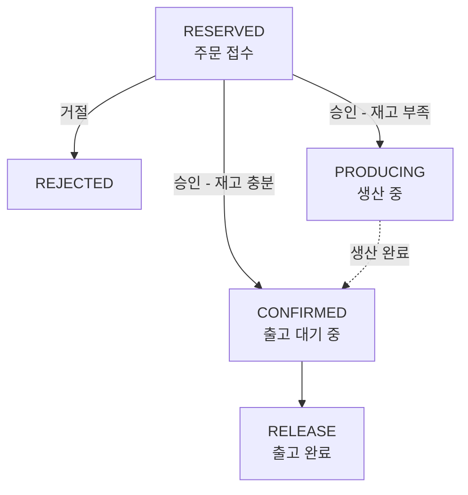

# PRD: 반도체 시료 생산주문관리 시스템 (S-Semi)

## 문서 정보

| 항목 | 내용 |
|---|---|
| 문서 목적 | 향후 구현할 제품의 요구사항 정의 |
| 근거 문서 | `initial_requirement.md` |
| 현재 구현 상태 | 없음 (`semi/__init__.py`만 존재하는 빈 패키지) |
| 작성일 | 2026-07-15 |

---

## 1. 배경 및 목적

가상의 반도체 회사 **S-Semi**는 다양한 반도체 시료(Sample)를 생산하여 연구소, 팹리스(Fabless) 업체, 대학 연구실 등에 납품한다.

시료는 주문 접수 → 생산 담당자 승인/거절 → (필요 시) 생산 → 출고의 흐름을 거치며, 기존에는 엑셀과 메모장으로 이를 관리해 다음과 같은 문제가 있었다.

- 주문 처리 여부를 파악하기 어려움
- 공정 완료 시점을 예측하기 어려움
- 재고와 생산 현황이 불일치해도 인지하지 못함

이를 해결하기 위해 **콘솔 기반 반도체 시료 생산주문관리 시스템**을 구축한다.

## 2. 사용자 역할

| 역할 | 주요 업무 |
|---|---|
| 고객 | 필요한 시료를 요청 (시스템 사용자는 아니며, 요청은 주문 담당자를 통해 시스템에 입력됨) |
| 주문 담당자 | 고객 요청에 맞게 주문서를 작성(시료 예약)하고 생산 담당자에게 전달 |
| 생산 담당자 | 시료를 등록하고, 접수된 주문을 승인하거나 거절 |

시스템은 콘솔 기반 단일 애플리케이션으로 동작하며, 담당자가 메뉴를 통해 명령을 직접 입력한다. 역할별 로그인/권한 분리는 없다 (5절, 규칙 15 참조).

## 3. 핵심 도메인 개념

### 3.1 시료 (Sample)

시스템의 가장 기본 단위. 등록된 시료만 주문 가능하다.

| 속성 | 설명 |
|---|---|
| 시료 ID | 고유 식별자 |
| 이름 | 시료명 |
| 평균 생산시간 | 시료 1개를 생산하는 데 걸리는 평균 시간. 단위는 **초(seconds)** 로 통일하며, 0보다 커야 한다 |
| 수율 | 정상 시료 수 / 총 생산 시료 수 (예: 0.9). **0보다 크고 1 이하**(`0 < 수율 <= 1`)여야 한다 |
| 현재 재고 수량 | 새로 등록된 시료의 초기 재고는 항상 0개이며, 이후 생산을 통해서만 증가한다 |

### 3.2 주문 (Order)

| 속성 | 설명 |
|---|---|
| 주문 ID | 고유 식별자. 시스템이 주문 접수 시 자동으로 채번하며, 담당자가 승인/거절/출고 대상 주문을 선택할 때 이 ID로 특정한다 |
| 시료 ID | 주문 대상 시료 |
| 고객명 | 주문 요청 고객 |
| 주문 수량 | 요청 수량 |
| 상태 | 아래 상태 흐름 참조 |

### 3.3 주문 상태 흐름



| 상태 | 의미 |
|---|---|
| `RESERVED` | 주문 접수 (초기 상태) |
| `REJECTED` | 주문 거절. 정상 흐름 밖의 상태이며 모니터링 대상에서 제외 |
| `PRODUCING` | 주문 승인 완료, 재고 부족으로 생산 중 |
| `CONFIRMED` | 주문 승인 완료, 출고 대기 중 |
| `RELEASE` | 출고 완료 |

> 상태명은 `initial_requirement.md` 1.4절 표기(`RELEASE`)를 기준으로 통일한다. 동일 문서 내 다이어그램/2.7절 서술의 `RELEASED` 표기는 오기로 간주한다.

## 4. 기능 요구사항

### 4.1 메인 메뉴

기능별 선택 화면과 전체 시료 요약 정보를 표시한다.

| 메뉴 | 설명 |
|---|---|
| 시료 관리 | 신규 시료 등록, 목록 조회, 이름 검색 |
| 주문 접수 / 승인 / 거절 | 고객 주문 접수 및 생산 담당자의 승인·거절 처리 |
| 모니터링 | 상태별 주문 수 및 시료별 재고 현황 확인 |
| 출고 처리 | `CONFIRMED` 상태 주문에 대한 출고 실행 |
| 생산 라인 | 현재 생산 중인 시료 및 대기 중인 생산 큐 확인 |

### 4.2 시료 관리

- **시료 등록**: 시료 ID, 이름, 평균 생산시간, 수율을 입력받아 신규 시료를 등록한다. 초기 재고는 항상 0개이다.
  - 평균 생산시간은 0보다 커야 하고, 수율은 `0 < 수율 <= 1` 범위여야 하며, 이를 벗어나는 값은 등록을 거부한다. (수율이 1을 초과하면 `실 생산량 = ceil(부족분 / 수율)`이 부족분보다 작아질 수 있어, 4.4절의 "재고는 항상 미출고 CONFIRMED 합계 이상으로 유지된다"는 보장이 깨진다.)
- **시료 조회**: 등록된 모든 시료와 현재 재고 수량을 표시한다.
- **시료 검색**: 이름 등 속성으로 특정 시료를 검색한다.

### 4.3 주문 접수 (시료 예약)

- 주문 담당자가 시료 ID, 고객명, 주문 수량을 입력해 주문을 생성한다.
- 주문 수량은 0보다 커야 하며, 이를 벗어나는 값은 주문 생성을 거부한다.
- 등록되지 않은 시료 ID로는 주문을 생성할 수 없다.
- 생성 직후 주문 상태는 `RESERVED`이다.

### 4.4 주문 승인 및 거절

- `RESERVED` 상태 주문 목록을 조회한 뒤, 담당자가 개별 주문을 선택해 승인 또는 거절한다.
- 여러 주문이 대기 중일 때, 담당자는 임의의 순서로 주문을 골라 처리할 수 있다(강제된 처리 순서 없음).
- 재고 충분/부족 여부는 **"가용 재고"** 를 기준으로 판단한다. 가용 재고는 다음과 같이 계산한다.

  ```text
  가용 재고 = 해당 시료의 현재 재고 수량
            - (해당 시료에 대해 아직 출고되지 않은 CONFIRMED 상태 주문 수량 합계)
            - (해당 시료의 PRODUCING 상태 주문들이 승인 당시 이미 점유한 기존 재고 몫의 합계)
  ```

  - "`PRODUCING` 주문이 점유한 기존 재고 몫"이란 해당 주문이 승인되던 시점에 사용된 가용 재고만큼(= 주문 수량 - 그때 등록된 부족분)을 말한다. 이 값은 해당 주문이 `CONFIRMED`로 전환되기 전까지 고정되어 계속 가용 재고에서 제외된다.
  - 주문이 이후 생산 완료되어 `CONFIRMED`로 전환되면, 위 몫은 "`PRODUCING` 점유분" 계산에서 빠지는 대신 전체 주문 수량이 "`CONFIRMED` 주문 수량 합계"에 새로 포함되어 계속 반영된다.
  - 이미 승인된(= `CONFIRMED`이거나 `PRODUCING`인) 주문이 필요로 하는 기존 재고는 이렇게 항상 가용 재고에서 미리 제외되지만, 아직 대기 중인 `RESERVED` 주문에는 재고를 미리 배정하지 않는다 (`RESERVED` 주문이 많다고 해서 가용 재고가 줄지 않는다).
  - 이 계산 방식 덕분에 실제 재고는 언제나 미출고 `CONFIRMED` 주문 수량 합계 이상으로 유지되며, 그 결과 4.7절 출고 처리 시 재고 부족으로 거부되는 경우는 발생하지 않는다.

**승인**
1. 가용 재고가 주문 수량 이상이면: 상태를 `CONFIRMED`로 변경한다. (재고 차감은 하지 않는다 — 4.7절 참조)
2. 가용 재고가 주문 수량보다 적으면: 부족분(주문 수량 - 가용 재고)에 대한 생산 작업을 생산 큐에 등록하고 상태를 `PRODUCING`으로 변경한다.

**거절**
- 선택한 주문을 즉시 `REJECTED` 상태로 변경한다.

### 4.5 모니터링

- **주문량 확인**: `RESERVED`, `CONFIRMED`, `PRODUCING`, `RELEASE` 상태별 주문 목록 또는 건수를 표시한다. `REJECTED`는 제외한다.
- **재고량 확인**: 시료별 현재 재고 수량과 주문 대비 상태를 표시한다.

비교 대상이 되는 "주문 수량"은 해당 시료에 대해 아직 완료(`RELEASE`)되지 않은 전체 주문(`RESERVED` + `CONFIRMED` + `PRODUCING`)의 수량 합계로 한다. `RESERVED`까지 포함하는 이유는, 모니터링은 아직 승인되지 않은 수요까지 포함한 "전체 잠재 수요 대비 재고"를 보여주기 위한 것이기 때문이다.

> 이는 4.4절의 "가용 재고"(승인 판단용, `RESERVED`는 제외하고 `CONFIRMED`+`PRODUCING`만 차감)와는 목적과 계산 범위가 다르다. 따라서 모니터링에서는 "부족"으로 표시되더라도, 아직 `RESERVED`인 대기 주문 때문일 뿐 실제 승인 가능 여부(가용 재고)와는 무관할 수 있다.

| 재고 상태 | 의미 |
|---|---|
| 여유 | 재고 > 0 이고 재고 >= 미완료 주문 수량 합계 |
| 부족 | 0 < 재고 < 미완료 주문 수량 합계 |
| 고갈 | 재고 수량이 0임 (미완료 주문 수량 합계와 무관하게 우선 적용) |

### 4.6 생산 라인

- 시스템에는 **단일 생산 라인 1개**만 존재하며, 한 번에 시료 하나만 생산한다.
- 생산 대기열(생산 큐)은 **FIFO(선입선출)** 방식으로 처리된다.

**생산량/생산시간 계산**

```text
실 생산량 = ceil(부족분 / 수율)
총 생산 시간 = 평균 생산시간 × 실 생산량
```

- "수율"은 공정 특성상 발생하는 불량률을 이미 반영한 값으로 간주하며, 별도의 생산 오차 계산은 적용하지 않는다.
- 여기서 "실 생산량"(`ceil(부족분 / 수율)`)은 부족분을 확보하기 위해 필요한 "시도 횟수"의 의미이며, 그 값 자체가 최종 재고 증가분(양품 수)으로 그대로 반영된다. 수율은 이 시도 횟수를 늘리는 데만 사용되며, 산출된 실 생산량에 수율을 다시 곱해 줄이지 않는다.

**생산 완료 처리**

```text
PRODUCING -> CONFIRMED
```

- 생산이 완료되면 실 생산량만큼 재고가 증가하고, 해당 생산 작업을 발생시킨 주문의 상태가 `CONFIRMED`로 전환된다.
- 생산 큐에 등록된 작업은 등록 당시 계산된 부족분/실 생산량대로 끝까지 진행된다. 대기 중 다른 주문의 생산 완료 등으로 재고 상황이 바뀌더라도(예: 잉여 생산으로 재고가 늘어나 더 이상 부족하지 않게 되어도), 이미 등록된 생산 작업은 재계산되거나 조기 완료 처리되지 않는다.

**생산 현황 표시**

현재 생산 중인 작업에 대해 다음 정보를 표시한다 (세부 항목/표시 수준은 구현 시 자유롭게 결정 가능).

- 주문 정보 / 시료 정보
- 주문 수량 / 부족분 / 실 생산량
- 현재까지의 생산량 또는 진행률
- 예상 완료 시간

**생산 큐 조회**

- 생산 대기 중인 작업 목록을 FIFO 순서로 표시한다.

### 4.7 출고 처리

- `CONFIRMED` 상태 주문 목록을 표시한다.
- 담당자가 특정 주문을 선택해 출고를 실행한다.
- 출고 시 재고에서 주문 수량만큼 차감하고, 주문 상태를 `RELEASE`로 변경한다. **재고 차감은 이 시점에만 이루어진다** (4.4절 "가용 재고" 계산 방식 덕분에 이 시점에 재고가 부족한 경우는 발생하지 않는다).

```text
CONFIRMED -> RELEASE
```

## 5. 비기능 요구사항

| 항목 | 요구사항 |
|---|---|
| 운영 방식 | 콘솔 기반, 담당자 직접 명령 입력 |
| 데이터 영속성 | 주문/재고/생산 데이터는 프로그램 종료 후에도 보존되어야 하며, 파일 또는 DB에 영구 저장한다 (저장 방식·포맷은 상세 설계 단계에서 결정) |
| 권한 분리 | 고객/주문 담당자/생산 담당자 역할별 로그인이나 메뉴 접근 제한은 없다. 콘솔 애플리케이션을 실행하는 사람이 곧 해당 역할을 수행하는 것으로 간주하며, 모든 메뉴에 제한 없이 접근 가능하다 |
| 기술 스택 | Python (`pyproject.toml` 기준 패키지명 `semi`) |

## 6. 핵심 도메인 규칙 요약

1. 시스템에 등록된 시료만 주문할 수 있다.
2. 신규 등록 시료의 초기 재고는 항상 0개이다.
3. 새 주문의 초기 상태는 `RESERVED`이다.
4. 담당자는 대기 중인 `RESERVED` 주문을 임의 순서로 개별 승인/거절할 수 있다.
5. 주문 승인 시 "가용 재고"(해당 시료의 현재 재고 - 미출고 `CONFIRMED` 주문 수량 합계 - `PRODUCING` 주문들의 기존 재고 점유분 합계)가 주문 수량 이상이면 `CONFIRMED`로 전환한다 (실제 재고 차감은 하지 않는다).
6. 가용 재고가 주문 수량보다 적으면 부족분(주문 수량 - 가용 재고)을 생산 큐에 등록하고 `PRODUCING`으로 전환한다. 이때 사용된 가용 재고만큼이 해당 주문의 "기존 재고 점유분"으로 고정되어, 그 주문이 `CONFIRMED`로 전환되기 전까지 계속 가용 재고 계산에서 제외된다.
7. 실 생산량은 `ceil(부족분 / 수율)`로 계산하며 (수율에 불량률이 이미 반영된 것으로 간주), 총 생산 시간은 `평균 생산시간 × 실 생산량`으로 계산한다.
8. 생산 큐는 단일 생산 라인에서 FIFO 방식으로 처리한다.
9. 생산 완료 시 `PRODUCING`에서 `CONFIRMED`로 전환하고 실 생산량만큼 재고가 증가한다 (역시 재고 차감은 없다).
10. 재고 차감은 출고 시점에만 이루어진다. 4.4절의 가용 재고 계산 방식(규칙 5, 6) 덕분에 실제 재고는 항상 미출고 `CONFIRMED` 주문 수량 합계 이상으로 유지되므로, 출고 시 재고 부족 상황은 발생하지 않는다.
11. 출고 완료 시 `CONFIRMED`에서 `RELEASE`로 전환한다.
12. 거절된 주문은 `REJECTED`로 전환되며 모니터링에서 제외한다.
13. 모든 주문/재고/생산 데이터는 프로그램 종료 후에도 영구 저장되어야 한다.
14. 재고 상태(여유/부족/고갈)는 해당 시료의 `RELEASE`되지 않은 전체 주문(`RESERVED`+`CONFIRMED`+`PRODUCING`) 수량 합계 대비 재고로 판정하되, 재고 수량이 0이면 주문 수량 합계와 무관하게 항상 "고갈"로 판정한다.
15. 역할별 로그인/접근 권한 분리는 없으며, 콘솔 실행자가 모든 메뉴에 제한 없이 접근할 수 있다.
16. 주문에는 시스템이 자동 채번하는 고유 주문 ID가 있으며, 담당자는 이 ID로 개별 주문을 선택한다.
17. 시료 등록 시 평균 생산시간은 0보다 커야 하고, 수율은 `0 < 수율 <= 1` 범위를 벗어날 수 없다 (수율이 1을 초과하면 규칙 5·6·10의 재고 보장이 깨진다).
18. 주문 접수 시 주문 수량은 0보다 커야 한다.

## 7. 미결 사항 (Open Questions)

- 영구 저장소의 구체적 형태(파일 포맷, DB 종류 등)는 아직 결정되지 않았으며, 상세 설계 단계에서 정한다 (기술 구현 사항으로 판단하여 본 PRD에서는 확정하지 않음).
